## Member

| Nama | NRP |
| :--- | :--- |
| Jonathan Steven Tjahjaputra | 5027251036 |
| Helen Audya Yuniarini | 5027251069 |

---

# Laporan

## 1. Persiapan The Wired

Pada praktikum ini dibuat sebuah topologi jaringan yang terdiri dari satu router utama dan tiga segmen jaringan. Router `Lain` berfungsi sebagai penghubung antar-subnet sekaligus sebagai gateway bagi masing-masing client.

Struktur topologi yang digunakan:

```sh
GAMBAR DISINI
```

Pembagian alamat IP menggunakan prefix kelompok `10.80.x.x`.

| Node | Interface | IP Address | Gateway |
| :--- | :--- | :--- | :--- |
| Lain | eth0 | DHCP | NAT |
| Lain | eth1 | `10.80.1.1/24` | - |
| Lain | eth2 | `10.80.2.1/24` | - |
| Lain | eth3 | `10.80.3.1/24` | - |
| Alice | eth0 | `10.80.1.10/24` | `10.80.1.1` |
| Mika | eth0 | `10.80.1.11/24` | `10.80.1.1` |
| Chisa | eth0 | `10.80.2.10/24` | `10.80.2.1` |
| Knights | eth0 | `10.80.3.10/24` | `10.80.3.1` |
| Eiri | eth0 | `10.80.3.11/24` | `10.80.3.1` |

Router `Lain` menggunakan tiga interface internal untuk melayani ketiga subnet tersebut, sedangkan `eth0` digunakan untuk koneksi menuju NAT dan Internet.

---

## 2. Konfigurasi ke Internet

Konfigurasi interface pada router `Lain` dibuat menggunakan alamat statis untuk masing-masing subnet.

Lokasi File konfigurasi:

```sh
/etc/network/interfaces
```

Konfigurasi yang digunakan:

```sh
auto eth0
iface eth0 inet dhcp

auto eth1
iface eth1 inet static
    address 10.80.1.1
    netmask 255.255.255.0

auto eth2
iface eth2 inet static
    address 10.80.2.1
    netmask 255.255.255.0

auto eth3
iface eth3 inet static
    address 10.80.3.1
    netmask 255.255.255.0
```

Konfigurasi client disesuaikan dengan subnet masing-masing.

### Alice

```sh
auto eth0
iface eth0 inet static
    address 10.80.1.10
    netmask 255.255.255.0
    gateway 10.80.1.1
```

### Mika

```sh
auto eth0
iface eth0 inet static
    address 10.80.1.11
    netmask 255.255.255.0
    gateway 10.80.1.1
```

### Chisa

```sh
auto eth0
iface eth0 inet static
    address 10.80.2.10
    netmask 255.255.255.0
    gateway 10.80.2.1
```

### Knights

```sh
auto eth0
iface eth0 inet static
    address 10.80.3.10
    netmask 255.255.255.0
    gateway 10.80.3.1
```

### Eiri

```sh
auto eth0
iface eth0 inet static
    address 10.80.3.11
    netmask 255.255.255.0
    gateway 10.80.3.1
```

Konfigurasi tersebut membuat setiap client memiliki alamat IP dan gateway sesuai subnetnya.

---

## 3. Mengaktifkan IP Forwarding pada Router

Agar router `Lain` dapat meneruskan paket dari satu subnet ke subnet lainnya, IPv4 forwarding harus diaktifkan.

Perintah:

```sh
sysctl -w net.ipv4.ip_forward=1
```

Pengecekan:

```sh
cat /proc/sys/net/ipv4/ip_forward
```

Jika menghasilkan `1`, berarti IP forwarding aktif. IP forwarding memungkinkan paket dari satu subnet diteruskan menuju subnet lain melalui router `Lain`.

Contoh pengujian:

```bash
ping -c 4 10.80.2.10
```

dari Alice menuju Chisa.

---

## 4. Source NAT dan Akses Internet

Router `Lain` dikonfigurasi agar client dapat mengakses Internet melalui NAT.

DNS dikonfigurasi menggunakan:

```sh
echo "nameserver 8.8.8.8" > /etc/resolv.conf
```

Source NAT:

```sh
iptables -t nat -A POSTROUTING -o eth0 -j MASQUERADE
```

Forwarding dari subnet internal menuju Internet:

```sh
iptables -A FORWARD -i eth1 -o eth0 -j ACCEPT
iptables -A FORWARD -i eth2 -o eth0 -j ACCEPT
iptables -A FORWARD -i eth3 -o eth0 -j ACCEPT
iptables -A FORWARD -i eth0 -m state --state ESTABLISHED,RELATED -j ACCEPT
```

Pengujian konektivitas:

```sh
ping -c 4 8.8.8.8
ping -c 4 google.com
```

Ping ke alamat IP digunakan untuk menguji konektivitas, sedangkan ping ke nama domain juga menguji fungsi DNS.

---

## 5. Pemeriksaan Status Router

Untuk mempermudah pemeriksaan konfigurasi router dibuat script:

```text
/root/cek_status.sh
```

Isi script:

```bash
#!/bin/sh

ip -br a
iptables -t nat -L -v -n
```

Script digunakan untuk memeriksa interface jaringan dan aturan NAT yang sedang aktif.

Konfigurasi yang berada di `/root` juga digunakan sebagai tempat penyimpanan script pemulihan ketika konfigurasi node perlu dibuat kembali.

---

## 6. Traffic ICMP dan DNS

Traffic jaringan dibuat menggunakan:

```text
/root/traffic_protocol7.sh
```

Script menghasilkan traffic ICMP dan DNS.

Contoh traffic ICMP:

```bash
ping 8.8.8.8
ping 1.1.1.1
ping its.ac.id
```

DNS query:

```bash
nslookup google.com 8.8.8.8
nslookup its.ac.id 8.8.8.8
nslookup github.com 1.1.1.1
```

Selain itu digunakan:

```bash
dig @8.8.8.8 example.com A
dig @1.1.1.1 cloudflare.com AAAA
```

Traffic dianalisis menggunakan filter Wireshark:

```text
dns || icmp
```

Hasil capture dapat digunakan untuk mengamati Echo Request, Echo Reply, DNS query, dan DNS response.

---

## 7. FTP Server pada Chisa

Chisa digunakan sebagai FTP Server dengan direktori:

```sh
/var/wired/data
```

FTP server menggunakan `vsftpd`.

Direktori dibuat dengan:

```sh
mkdir -p /var/wired/data
mkdir -p /etc/vsftpd/user_conf

chmod 755 /var/wired
chmod 777 /var/wired/data
```

User FTP adalah Alice, Mika, dan Eiri

Konfigurasi utama:

```text
listen=YES
anonymous_enable=NO
local_enable=YES
write_enable=YES

local_root=/var/wired/data

chroot_local_user=YES
allow_writeable_chroot=YES

userlist_enable=YES
userlist_deny=YES
userlist_file=/etc/vsftpd.userlist

user_config_dir=/etc/vsftpd/user_conf

seccomp_sandbox=NO
```

Akun `eiri` dimasukkan ke `/etc/vsftpd.userlist` sehingga akses FTP-nya ditolak.

Konfigurasi Alice:

```text
write_enable=YES
```

Konfigurasi Mika:

```text
write_enable=NO
```

Hak akses:

| User | Read | Write |
| :--- | :---: | :---: |
| Alice | Ya | Ya |
| Mika | Ya | Tidak |
| Eiri | Tidak | Tidak |

---

## 8. Upload Report dari Knights ke Chisa

Knights mengirimkan dokumen laporan intelijen ke FTP Server Chisa menggunakan akun Alice.

File:

```text
/root/report.txt
```

Koneksi:

```bash
lftp -u alice 10.80.2.10
```

Upload:

```text
put /root/report.txt
```

Perintah FTP yang terlihat pada Wireshark adalah:

```text
STOR report.txt
```

Jika transfer berhasil, server memberikan:

```text
226 Transfer complete
```

Pada mode PASV, port data dihitung dari dua nilai yang diberikan server.

Pada hasil capture yang diperoleh:

```text
p1 = 163
p2 = 155
```

Perhitungan:

```text
163 × 256 + 155 = 41883
```

Dengan demikian port data TCP yang digunakan adalah:

```text
41883
```

`STOR` menunjukkan bahwa client meminta server menyimpan file, sedangkan kode `226` menunjukkan bahwa transfer data telah selesai dengan sukses.

---

## 9. Download Protocol 7 oleh Mika

Mika mengakses dokumen:

```text
protocol7_manifesto.txt
```

pada FTP Server Chisa.

Koneksi dilakukan dengan:

```bash
lftp -u mika 10.80.2.10
```

Download:

```text
get protocol7_manifesto.txt
```

Operasi `get` berhasil karena Mika memiliki hak baca.

Kemudian dilakukan pengujian untuk membuktikan bahwa Mika tidak memiliki hak tulis.

Setelah membuat file pengujian:

```text
put /root/mika_test.txt
```

Server memberikan respons:

```text
550 Permission denied
```

Hasil tersebut menunjukkan bahwa Mika dapat membaca file dari FTP tetapi tidak dapat melakukan upload.

---

## 10. Pengujian ICMP dari Knights ke Chisa

Pengujian koneksi dilakukan dari Knights menuju Chisa menggunakan payload 128 bytes dan interval 0,3 detik:

```bash
ping -c 77 -s 128 -i 0.3 10.80.2.10
```

Hasil pengujian:

```text
77 packets transmitted
77 packets received
0% packet loss
```

Nilai RTT:

```text
min = 0.437 ms
avg = 0.670 ms
max = 1.721 ms
mdev = 0.164 ms
```

Pada Wireshark:

| Jenis Paket | ICMP Type | Code |
| :--- | :---: | :---: |
| Echo Request | 8 | 0 |
| Echo Reply | 0 | 0 |

Echo Request merupakan paket permintaan yang dikirim Knights menuju Chisa, sedangkan Echo Reply merupakan balasan dari Chisa.

Tidak terdapat packet loss karena seluruh 77 paket yang dikirim menerima balasan.

---

## 11. Pengujian Kelemahan Telnet

Untuk pengujian Telnet dibuat akun:

```text
phantom_user
```

dengan password:

```text
wired_ghost
```

Telnet server dijalankan pada Chisa menggunakan port 23:

```bash
/usr/sbin/telnetd -p 23 &
```

Koneksi dari Eiri:

```bash
telnet 10.80.2.10
```

Login:

```text
Username : phantom_user
Password : wired_ghost
```

Traffic ditangkap menggunakan filter:

```text
tcp.port == 23
```

Melalui fitur **Follow TCP Stream**, username dan password dapat diamati sebagai plaintext.

Hal tersebut menunjukkan kelemahan utama Telnet, yaitu data sesi tidak dilindungi dengan enkripsi.

Pada komunikasi interaktif Telnet juga dapat ditemukan banyak paket TCP berukuran kecil. Hal ini dapat terjadi karena input karakter diteruskan segera oleh aplikasi. Namun TCP sendiri tidak menjamin satu karakter selalu berada pada satu paket karena packetization bergantung pada aplikasi dan TCP stack.

---

## 12. Port Scanning dari Alice ke Knights

Pada pengujian ini Alice berperan sebagai scanner dan Knights sebagai target.

Target:

```text
10.80.3.10
```

Port yang diuji:

| Port | Kondisi |
| :---: | :--- |
| 22 | Terbuka |
| 80 | Terbuka |
| 7777 | Tertutup |

Scanning dilakukan dari Alice menggunakan Netcat:

```bash
nc -vz 10.80.3.10 22
nc -vz 10.80.3.10 80
nc -vz 10.80.3.10 7777
```

Capture Wireshark menggunakan:

```text
tcp.port == 22 || tcp.port == 80 || tcp.port == 7777
```

Untuk port terbuka terlihat TCP three-way handshake:

```text
SYN
SYN, ACK
ACK
```

Contohnya:

```text
Alice → Knights : SYN
Knights → Alice : SYN, ACK
Alice → Knights : ACK
```

Untuk port tertutup, respons yang terlihat adalah:

```text
SYN
RST, ACK
```

Perbedaan tersebut terjadi karena port 22 dan 80 memiliki service yang sedang listen, sedangkan port 7777 tidak memiliki service yang menerima koneksi.

---

## 13. SSH Key-Based Authentication dari Mika ke Knights

Knights digunakan sebagai SSH Server dan dibuat user:

```text
admin_mika
```

Pada Mika dibuat pasangan SSH key menggunakan:

```bash
ssh-keygen -t ed25519
```

Public key Mika ditempatkan pada:

```text
/home/admin_mika/.ssh/authorized_keys
```

di Knights.

Permission direktori SSH:

```bash
chmod 700 /home/admin_mika/.ssh
```

Konfigurasi SSH:

```text
PubkeyAuthentication yes
PasswordAuthentication no
```

Pengujian:

```bash
ssh admin_mika@10.80.3.10
```

Jika berhasil, Mika dapat masuk ke Knights tanpa memasukkan password.

Untuk melihat proses autentikasi secara detail:

```bash
ssh -v admin_mika@10.80.3.10
```

Pada output dapat terlihat bahwa private key Mika digunakan untuk melakukan autentikasi public key.

### Analisis Wireshark

Capture dilakukan pada jalur:

```text
Mika → Lain → Switch 3 → Knights
```

Filter:

```text
tcp.port == 22
```

Tahapan yang diamati:

```text
TCP Three-Way Handshake
        ↓
Protocol Version Exchange
        ↓
Key Exchange Init
        ↓
Key Exchange
        ↓
New Keys
        ↓
Encrypted SSH Session
```

Pada awal koneksi terlihat TCP three-way handshake:

```text
SYN
SYN, ACK
ACK
```

Kemudian terdapat Protocol Version Exchange:

```text
Client: Protocol (SSH-2.0-OpenSSH_10.2)
Server: Protocol (SSH-2.0-OpenSSH_10.2)
```

Setelah itu client dan server melakukan Key Exchange Init:

```text
Client: Key Exchange Init
Server: Key Exchange Init
```

Pada tahap Key Exchange, kedua pihak melakukan negosiasi parameter kriptografi dan membentuk material kunci untuk sesi.

Setelah pesan `New Keys`, paket berikutnya ditampilkan sebagai encrypted packet. Isi autentikasi dan data sesi SSH tidak dapat dibaca secara langsung melalui packet capture.

Hal ini berbeda dengan Telnet. Pada Telnet, username dan password dapat terlihat sebagai plaintext melalui Follow TCP Stream. Pada SSH, komunikasi setelah proses pertukaran kunci dilindungi oleh enkripsi.

---

## Soal 14
**Deskripsi Soal:** Eiri gagal masuk lewat FTP, sehingga coba serangan brute-force ke form login web punya Alice.

**File capture:** `wired_bruteforce.pcapng`

**Analisis:** alamat IP penyerang, target IP beserta port yang diserang, password user `lain_admin`, web server software dan versi yang dilaporkan pada response header

**Validasi:** 
``` 
nc 10.4.89.247 3401 
```

### Penyelesaian dan Hasil Analisis
1. Filter dengan `http.request.method == "POST"` di kolom filter (menyaring semua request POST dan biasanya digunakan untuk mengirim username dan password)

2. Terlihat banyak request `POST /login.php` yang berulang-ulang ke IP yang sama:
   - **Source (IP penyerang):** `172.26.7.50`
   - **Destination (IP target):** `172.26.7.100`, port tujuan **8080**
3. Ganti filter dengan `http.response.code == 200` (mencari respon berhasil login, respon status 200)

4. Pada paket response yang sukses tadi **Follow > HTTP Stream**
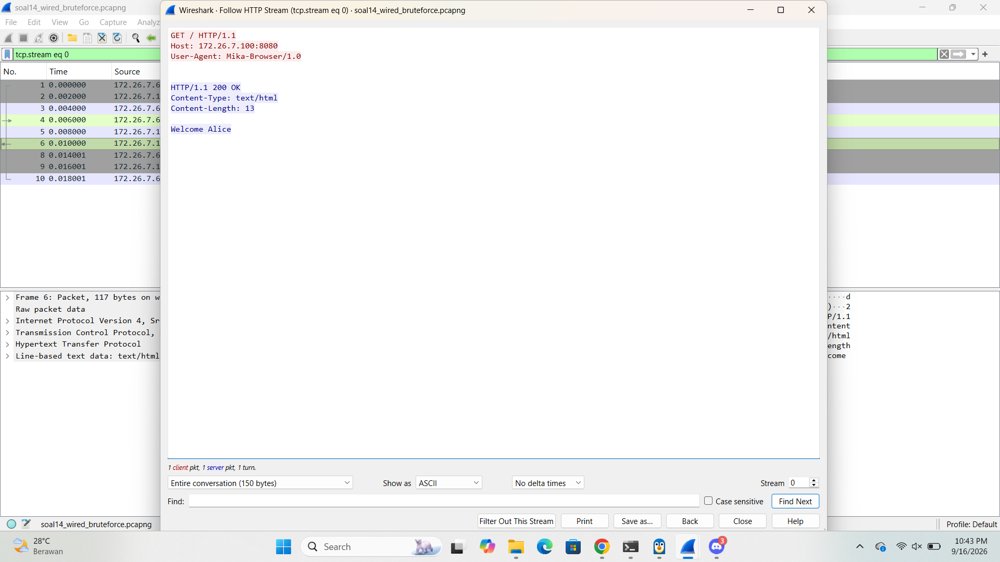
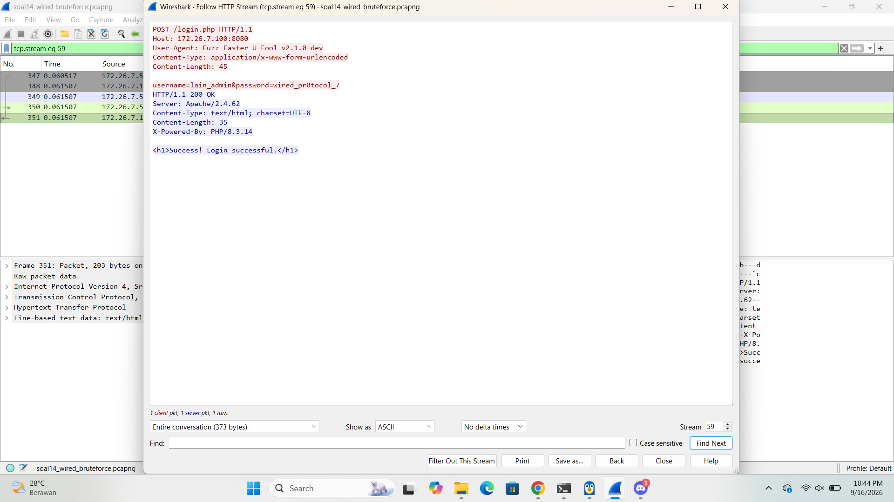
5. Ditemukan:
   - Kredensial: `username=lain_admin&password=wired_pr0tocol_7`
   - Header response server: `Server: Apache/2.4.62`

### Hasil Validasi
| Pertanyaan | Jawaban |
|---|---|
| IP penyerang | `172.26.7.50` |
| IP:Port target | `172.26.7.100:8080` |
| Password user `lain_admin` yang berhasil | `wired_pr0tocol_7` |
| Web server & versi | `Apache/2.4.62` |
**Flag:** `KOMJAR26{W1r3d_Brut3_WWhushWurqOHdQEJJgBB2eRtO}`


## Soal 15
**Deskripsi Soal:** Eiri menyusup ke ruang server dan memasang perangkat keyboard USB berbahaya pada node Alice.

**File capture:** `wired_usb_hid.pcap`

**Analisis:** Vendor ID, Product ID, alamat nomor device USB, pesan rahasia

**Validasi:** 
``` 
nc 10.4.89.247 3402
```

### Penyelesaian dan Hasil Analisis
1. Menemukan **GET DESCRIPTOR Response DEVICE**. Dalam bagian detail paket DEVICE DESCRIPTOR ditemukan:
   - **idVendor:** `Logitech, Inc. (0x046d)`
   - **idProduct:** `Keyboard K120 (0xc31c)`
   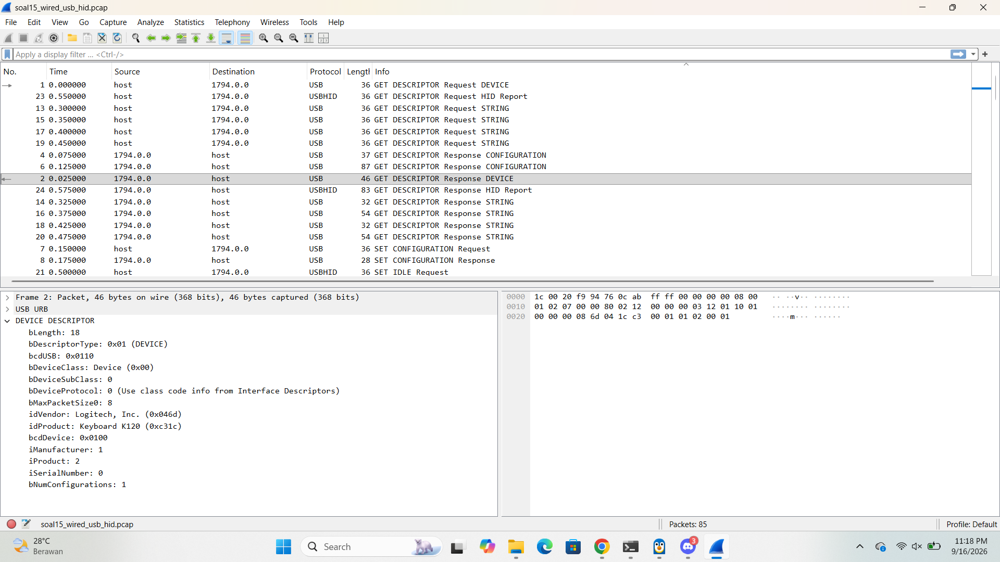
2. Mencari **device address** keyboardnya menggunakan tshark di terminal:
   ```
   tshark -r wired_usb_hid.pcap -T fields -e usb.device_address | sort -u
   ```
   Hasilnya keluar beberapa angka, yang jadi device address keyboard adalah **7**.
   
3. Membaca isi keystroke dengan command:
   ```
   tshark -r wired_usb_hid.pcap -Y "usb.capdata" -T fields -e usb.capdata
   ```
   Data yang keluar itu masih berupa hex code keycode USB HID (belum berupa huruf).
   
   
4. Membuat script Python `decode.py`

5. Jalankan `python3 decode.py`, hasilnya:
   ```
   Wired_Protocol_7_is_alive_2026
   ```
   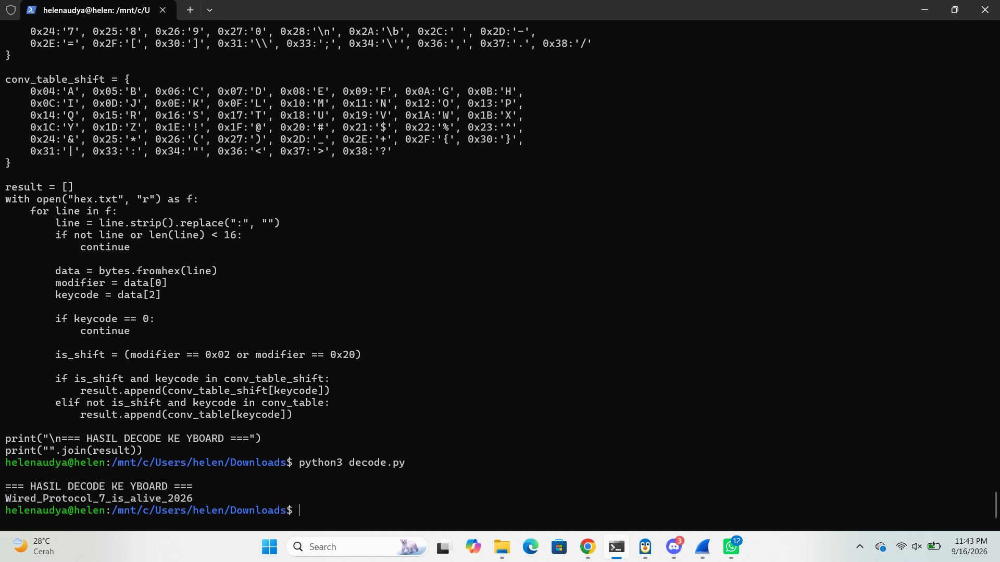
### Hasil Validasi
| Pertanyaan | Jawaban |
|---|---|
| Vendor ID | `0x046d` |
| Product ID | `0xc31c` |
| Device address keyboard | `7` |
| Pesan rahasia hasil decode keystroke | `Wired_Protocol_7_is_alive_2026` |
**Flag:** `KOMJAR26{USB_K3ystr0k3_mYabUdIBc1A2CHe51e3OG1H4Q}`


## Soal 16
**Deskripsi Soal:** Eiri menaruh file malware ke server melalui FTP.

**File capture:** `wired_ftp_theft.pcap`

**Analisis:** lalu lintas FTP untuk mengidentifikasi alamat IP server FTP penyerang, banner software FTP yang digunakan, kredensial login penyerang, serta ukuran (size in bytes) dari file malware knights_payload.exe yang diunduh

**Validasi:** 
``` 
nc 10.4.89.247 3403
```

### Penyelesaian dan Hasil Analisis
1. Filter file malware-nya (`knights_payload.exe`), langsung filter aja:
   ```
   ftp contains "knights_payload.exe"
   ```
   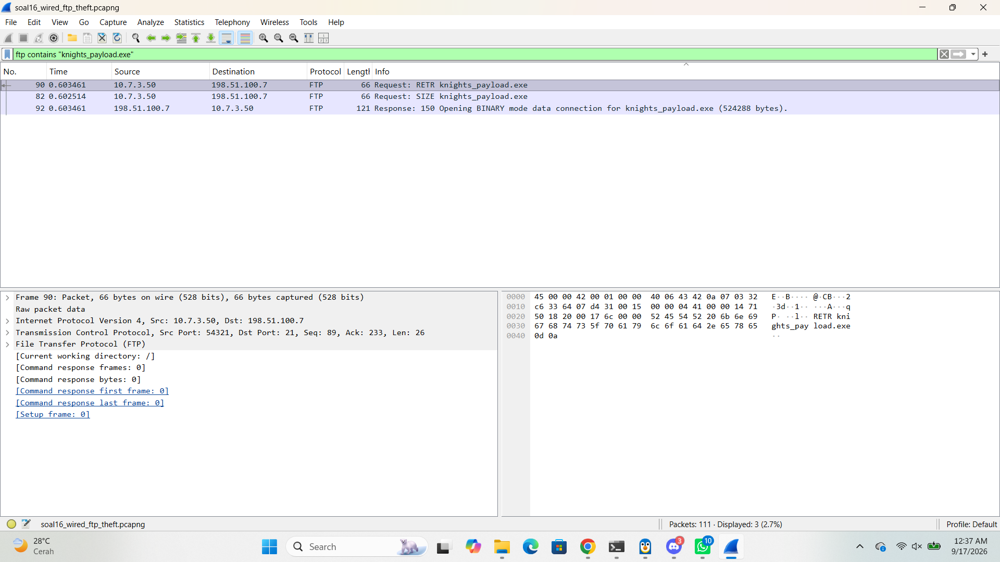
2. Menemukan paket **STOR** (perintah FTP buat upload file) dan response-nya. Dari situ:
   - **IP server FTP** (yang dituju attacker) = `198.51.100.7`
   - **Ukuran file** kelihatan di response: `524288 bytes`
3. Mencari banner FTP server, scroll ke awal koneksi FTP (paket pertama setelah TCP handshake), bakal ada response:
   ```
   220 Welcome to Wired FTP Server (vsftpd 3.0.5)
   ```
   
4. Mencari kredensial login attacker, cari pasangan paket `USER` dan `PASS` yang **langsung diikuti dengan aktivitas upload/STOR** (bukan percobaan login lain kayak `alice`, `mika`, atau `guest` yang cuma numpang lewat). Ditemukan:
   ```
   User: alice
   Password: alicepass2026

   User: mika
   Password: mikapass2026

   user: guest
   Password: guest

   USER knights_agent
   PASS N4v1_s3cur3_2026
   ```
   Login ini yang berhasil dan langsung dipakai buat upload `knights_payload.exe`.
   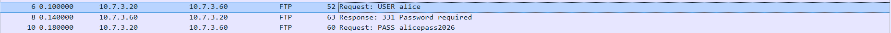
   
   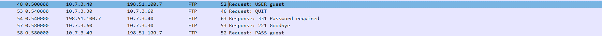
   
   
### Hasil Validasi
| Pertanyaan | Jawaban |
|---|---|
| Vendor ID | `0x046d` |
| Product ID | `0xc31c` |
| Device address keyboard | `7` |
| Pesan rahasia hasil decode keystroke | `Wired_Protocol_7_is_alive_2026` |
**Flag:** `KOMJAR26{USB_K3ystr0k3_mYabUdIBc1A2CHe51e3OG1H4Q}`
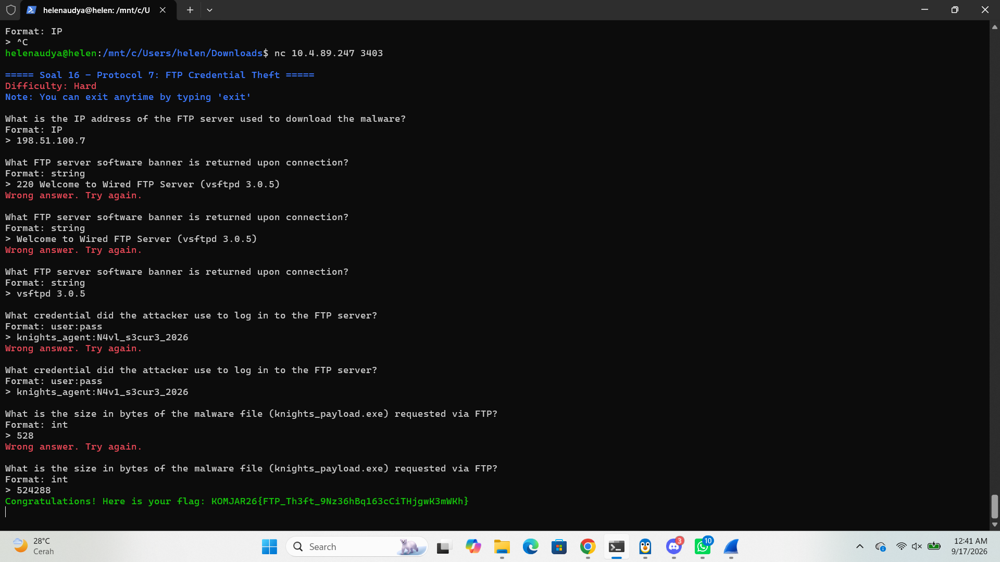

## Soal 17
**Deskripsi Soal:** Alice membuat web, dan Eiri memanfaatkan celah untuk mendownload payload berbahaya ke sistem Alice.

**File capture:** `wired_http_c2.pcap`

**Analisis:** nama domain (Host) tempat malware diunduh, alamat IP server penyerang, nama file executable malware yang diunduh, serta kode status HTTP yang dikembalikan

**Validasi:** 
``` 
nc 10.4.89.247 3404
```

### Penyelesaian dan Hasil Analisis
1. Filter `http.request` buat lihat semua request HTTP yang ada.
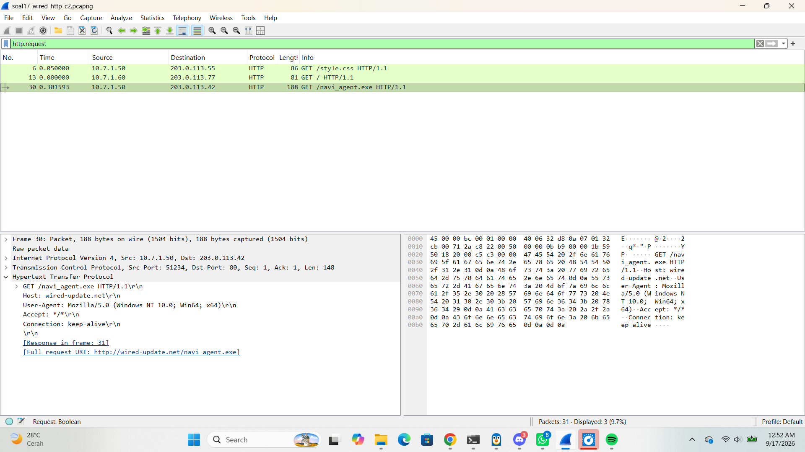
2. Mencari request `GET` yang paling mencurigakan yaitu yang minta file `.exe`. Ketemu:
   ```
   GET /navi_agent.exe HTTP/1.1
   Host: wired-update.net
   ```
   - **Host (nama domain)** tempat malware diunduh: `wired-update.net`
   - **IP tujuan** (server penyerang) request ini: `203.0.113.42`
   - **Full Request URI**: `http://wired-update.net/navi_agent.exe`
3. **Follow > HTTP Stream:** 
   ```
   HTTP/1.1 200 OK
   Content-Type: application/octet-stream
   Content-Disposition: attachment; filename="navi_agent.exe"
   ```
   Status code-nya **200** (artinya file berhasil didownload).
   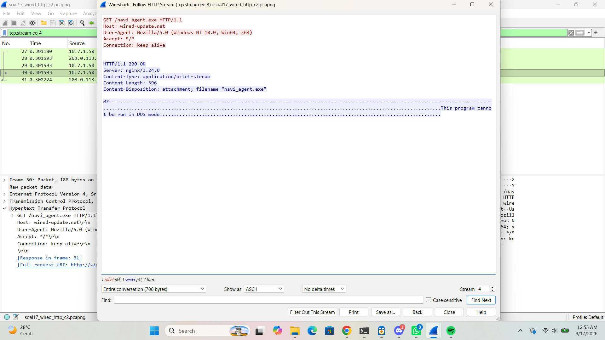
   
### Hasil Validasi
| Pertanyaan | Jawaban |
|---|---|
| Domain (Host) tempat malware diunduh | `wired-update.net` |
| IP server penyerang | `203.0.113.42` |
| Nama file executable malware | `navi_agent.exe` |
| Kode status HTTP | `200` |
**Flag:** `KOMJAR26{Navi_C2_D0wnl04d_C53TYxuAheyRSIln2ofntzcjE}`


## Soal 18
**Deskripsi Soal:** Eiri mengubah taktik dengan menanamkan file malware dengan protokol SMB.

**File capture:** `wired_smb_transfer.pcapng`

**Analisis:** nama protokol jaringan yang dieksploitasi, IP pengirim dan penerima, folder tujuan penyimpanan malware pada sistem korban, serta nama file executable malware yang ditransfer

**Validasi:** 
``` 
nc 10.4.89.247 3405
```

### Penyelesaian dan Hasil Analisis
1. Filter `smb2` untuk menyaring semua trafik SMB versi 2 ini protokol jaringan yang dieksploitasi.

2. Mencari paket **Tree Connect Request** (ini permintaan buat "connect" ke sebuah folder/share di komputer korban). Dari situ ketemu:
   - **Source IP**: `10.7.3.100`
   - **Destination IP**: `10.7.1.50`
   - **Path/Tree yang dituju**: `\\10.7.1.50\ADMIN$`
   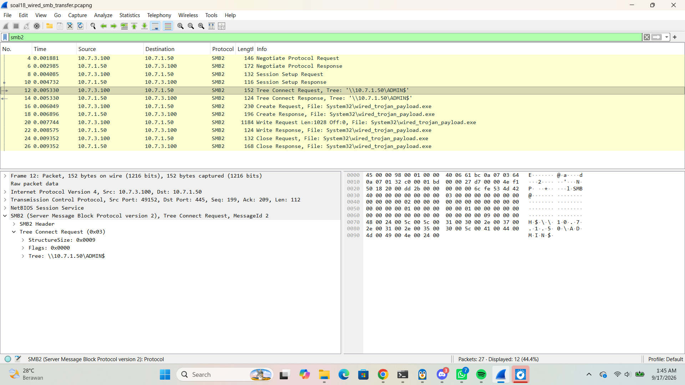
3. Mencari nama file yang ditransfer, filter tambahan `smb2.filename`. Ditemukan:
   ```
   wired_trojan_payload.exe
   ```
   
   
### Hasil Validasi
| Pertanyaan | Jawaban |
|---|---|
| Protokol jaringan yang dieksploitasi | `smb2` |
| IP pengirim | `10.7.3.100` |
| IP penerima (korban) | `10.7.1.50` |
| Folder tujuan penyimpanan malware | `\\10.7.1.50\ADMIN$` |
| Nama file executable malware | `wired_trojan_payload.exe` |
**Flag:** `KOMJAR26{SMB_Tr4nsf3r_B9I9ClCgKxP2F3kIJeP8V36ap}`
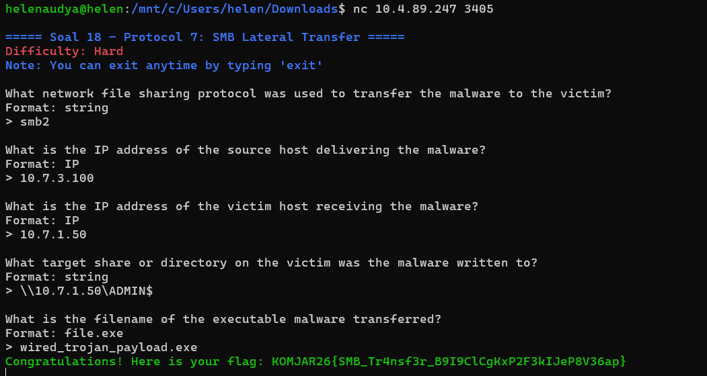

## Soal 19
**Deskripsi Soal:** Eiri meneror jaringan dengan mengirimkan email pemerasan melalui protokol SMTP tanpa enkripsi.

**File capture:** `wired_smtp_threat.pcap`

**Analisis:** alamat email korban yang ditargetkan, password korban yang diklaim bocor oleh penyerang, jenis malware yang diinfeksikan, batas waktu (dalam hari) yang diberikan, serta MailClientID yang tercantum pada pesan

**Validasi:** 
``` 
nc 10.4.89.247 3406
```

### Penyelesaian dan Hasil Analisis
1. Filter `smtp || tcp.port == 25`, port 25 itu port standar buat protokol SMTP (kirim email).
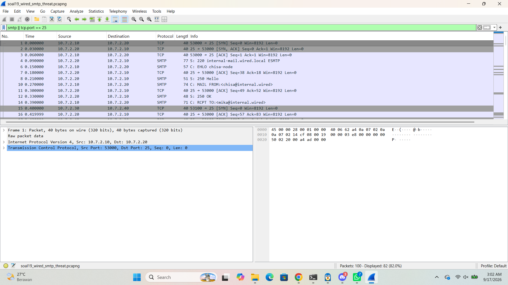
2. Klik salah satu paket di percakapan itu: **Follow > TCP Stream**, biar kelihatan seluruh isi percakapan SMTP (mulai `HELO`, `MAIL FROM`, `RCPT TO`, sampai `DATA`) dalam satu tampilan yang enak dibaca.

3. Kalau ada lebih dari satu TCP stream di situ, cek satu-satu sampai ketemu yang isinya email ancaman/pemerasan (bukan cuma email laporan biasa).

4. Dari isi stream yang berisi ancaman, ketemu detail:
   - **Email korban** yang dituju (`RCPT TO`): `victim@protocol7.co.jp`
   - **Password yang diklaim bocor** oleh pemeras: `pr0tocol_7_user`
   - **Jenis malware** yang diklaim menginfeksi: `ransomware`
   - **Batas waktu** bayar yang dikasih: `3` hari
   - **MailClientID** yang tercantum di bagian bawah pesan: `7719980706`
   
### Hasil Validasi
| Pertanyaan | Jawaban |
|---|---|
| Email korban | `victim@protocol7.co.jp` |
| Password yang diklaim dicuri | `pr0tocol_7_user` |
| Jenis malware yang diklaim menginfeksi | `ransomware` |
| Batas waktu (hari) | `3` |
| MailClientID | `7719980706` |
**Flag:** `KOMJAR26{SMTP_Ext0rt10n_0r64rNffFpoleFtK5JMdZ0Lul}`


## Soal 20
**Deskripsi Soal:** Eiri menyembunyikan komunikasi malware di balik saluran terenkripsi TLS. Namun Alice telah menyediakan file keylog untuk mendekripsi lalu lintas data tersebut. 

**File capture:** `wired_tls_decrypt.pcapng` + `keylogfile.txt`

**Analisis:** versi protokol TLS yang dinegosiasikan, nama domain (SNI) yang diakses, alamat IP server HTTPS penyerang, User-Agent yang digunakan, serta HTTP request method dan path yang tersembunyi di dalam sesi dekripsi

**Validasi:** 
``` 
nc 10.4.89.247 3407
```

### Penyelesaian dan Hasil Analisis
1. Masuk ke menu **Edit > Preferences > Protocols > TLS**.
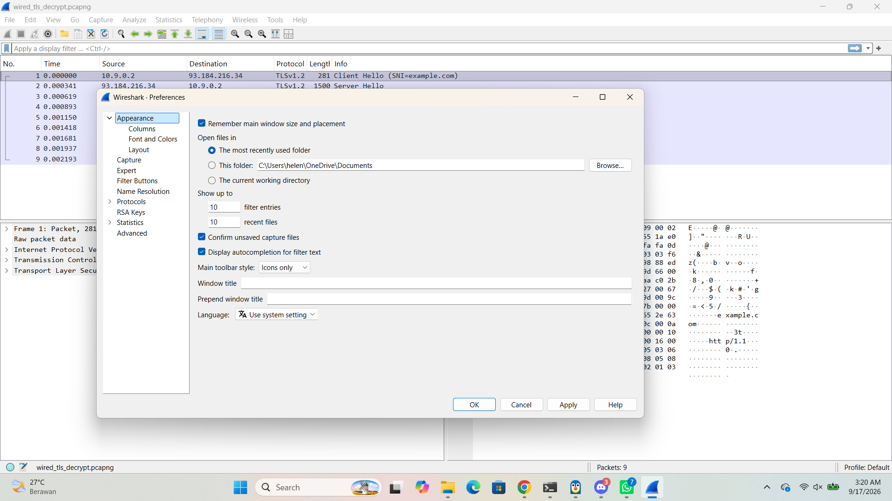
2. Di bagian **(Pre)-Master-Secret log filename**, klik **Browse** dan pilih file `keylogfile.txt`. Ini yang membuat Wireshark bisa "mengintip" isi paket TLS yang sebelumnya terenkripsi.

3. Klik **OK**.
4. Filter `tls.handshake.type == 1` untuk mencari paket **Client Hello** ini paket pertama pas TLS mulai "kenalan" (handshake), isinya info penting soal koneksi yang mau dibuat.
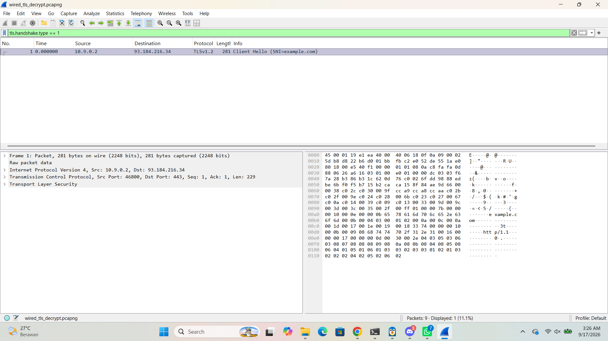
5. Dari paket Client Hello ini, ditemukan:
   - **Versi TLS** yang dinegosiasikan: `TLSv1.2`
   - **SNI (Server Name Indication / nama domain tujuan)**: `example.com`
6. Cek di header IP paketnya **IP server HTTPS**: `93.184.216.34`
7. Filter `http` (karena sudah didekripsi, HTTP di dalam TLS bisa kelihatan). Klik salah satu paket: **Follow > HTTP Stream** (atau TLS Stream) buat baca request lengkapnya:
   ```
   HEAD / HTTP/1.1
   Host: example.com
   User-Agent: curl/7.62.0
   ```
   - **User-Agent**: `curl/7.62.0`
   - **Method dan path request**: `HEAD /`
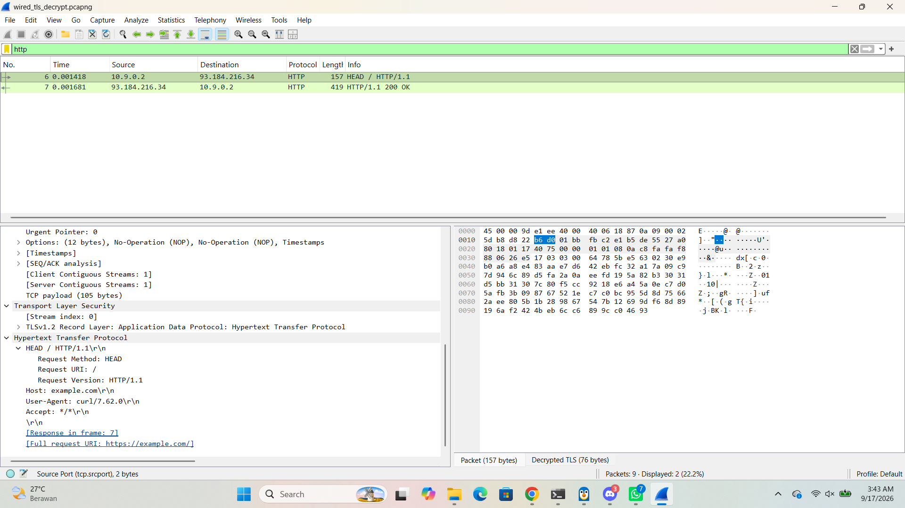
   
### Hasil Validasi
| Pertanyaan | Jawaban |
|---|---|
| Versi protokol TLS | `TLSv1.2` |
| Nama domain (SNI) | `example.com` |
| IP server HTTPS | `93.184.216.34` |
| User-Agent | `curl/7.62.0` |
| Method + path request | `HEAD /` |


**Flag:** `KOMJAR26{TLS_D3crypt_dJhAWIgytZs1jm4DqRKGaKFiG}`

